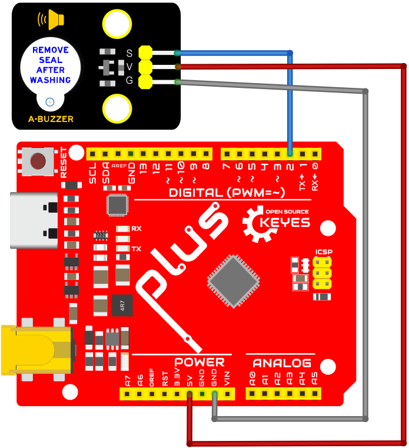
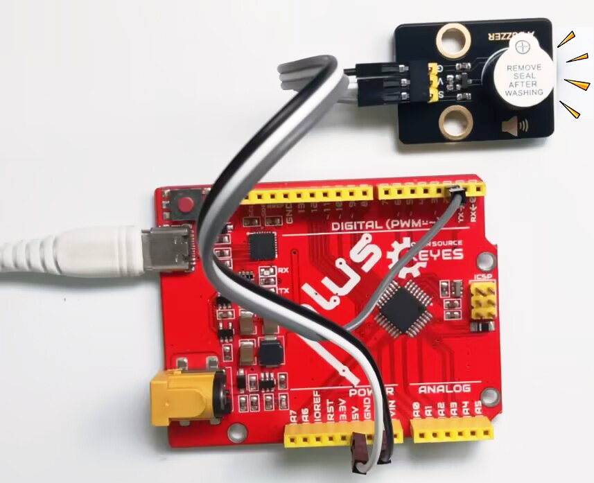
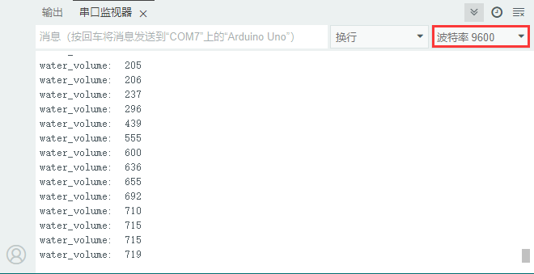
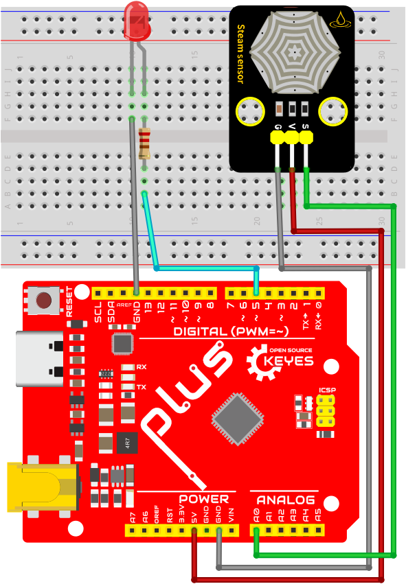
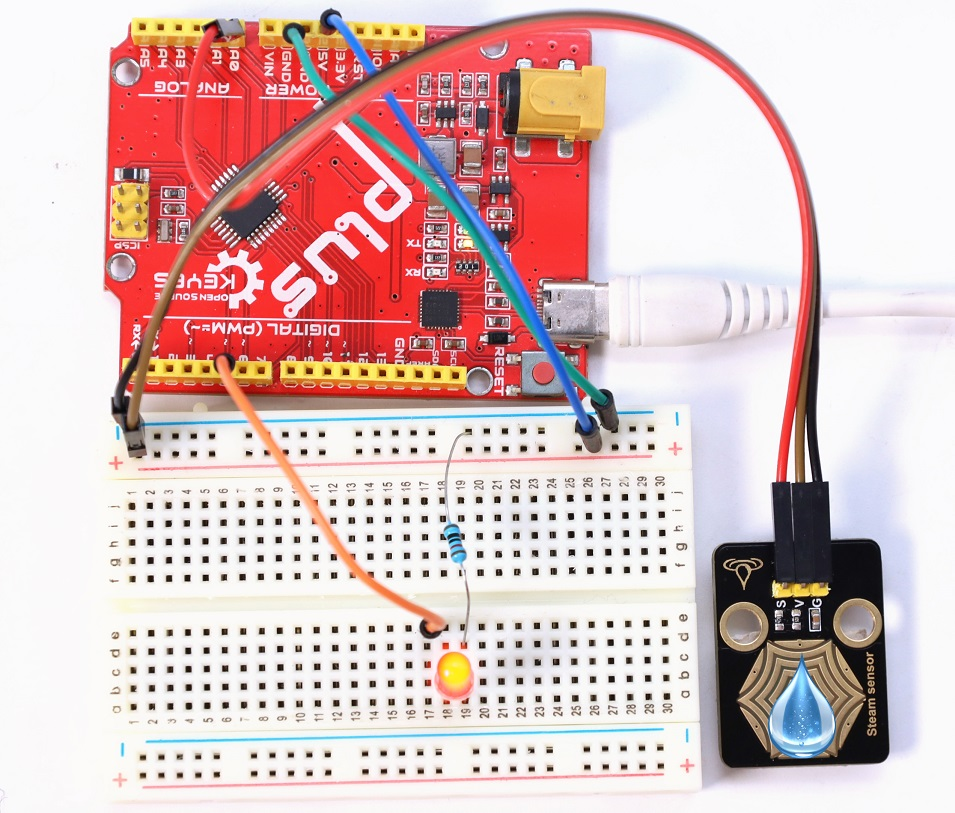

 # UNO主板_C_教程

## 1. Keyes Plus主板：

---

### 1. 简介：

在我们开始学习keyes 水滴检测套件之前，首先介绍Keyes Plus主板，它是所有项目的核心。

Keyes Plus主板完全兼容Arduino IDE开发环境的控制板，包含Arduino UNO R3的所有功能，并且在UNO R3主板的基础上，我们做了一些改进，使它的功能更加强大。它是学习如何构建电路和设计自己的代码的最好的选择，让我们得到更详细的相关信息：


---

### 2. 规格参数：

微控制器：ATMEGA328P-AU

USB转串口芯片：CP2102

工作电压：DC 5V

外接电源: DC 6-15V（建议9V）

数字I/O引脚: 14个 (D0-D13)

PWM通道：6个 (D3，D5，D6，D9，D10，D11)

模拟输入通道（ADC）: 8个 (A0-A7)

每个I/O直流输出能力:	20 mA

3.3V端口输出能力:	50 mA

Flash Memory: 32 KB（其中引导程序使用0.5 KB）

SRAM: 2 KB (ATMEGA328P-AU)

EEPROM:	1 KB (ATMEGA328P-AU)

时钟速度: 16MHz

板载LED引脚: D13

**各个接口和主要元件说明：**


**特殊功能接口说明：**

串口通信接口：D0为RX、D1为TX

PWM接口（脉宽调制）：D3，D5，D6，D9，D10，D11

外部中断接口：D2(中断0)和D3(中断1)

SPI通信接口：D10为SS，D11为MOSI，D12为MISO，D13为SCK

IIC通信端口：A4为SDA，A5为SCL

---

## 2. Arduino IDE 的下载、安装和使用方法：

参考链接：[https://www.keyesrobot.cn/projects/Arduino/zh-cn/latest/](https://www.keyesrobot.cn/projects/Arduino/zh-cn/latest/)

<span style="color: rgb(255, 76, 65);">注意：</span><span style="background:#ff0;color:#000">UNO主板_C_教程里所有课程使用的是Arduino IDE版本：2.1.1 。</span>

---

## 3. 课程

---

### 项目01 Hello World

#### 1. 项目介绍：

对于Arduino初学者，我们将从一些简单的东西开始。在这个项目中，您只需要一个Plus主板、MicroUSB线和计算机来完成“Hello World!”项目。它不仅是Plus主板(兼容Arduino Uno)和计算机的通信测试，也是Arduino世界的初级项目。

#### 2. 项目元件：

| |  |
| :--: | :--: |
|Plus主板*1 | MicroUSB线*1 |

#### 3. 项目接线：


#### 4. 项目代码：

将使用一个简单的If()语句编程控制结构。Arduino IDE使用串行监视器来显示打印语句、传感器数据等信息。这是一个非常强大的工具，用于调试长代码。现在是你的第一个代码：

```C
//*************************************************************************************
/*
 * 名称   : Hello World
 * 功能   : 输入字母R，串口显示“Hello World”。
 * 作者   : http://www.keyes-robot.com/
*/
char val;//定义变量val.

void setup(){
Serial.begin(9600);// 设置波特率为9600. 
}

void loop(){
  if (Serial.available() > 0) {
    val=Serial.read();// 读取指令或字符从PC到Arduino，并赋值给val.
    if(val=='R') {  // 确定接收的指令或字符是否为“R”.    
     Serial.println("Hello World!");// 显示“Hello World !”字符串.
    }
  }
}
//*************************************************************************************
```

#### 5. 项目现象： 

按照接线图正确接好各元器件，选择正确的主板类型Arduino Uno和COM端口，点击Arduino IDE上的上传按钮上传代码。上传成功后，利用MicroUSB线连接到计算机上电，单击图标进入串行监视器，设置波特率为 **9600** ，在文本框输入字母“R”，按下回车键(Enter 键)，这样串口监视器打印“Hello World!”。


#### 6. 代码说明

| 代码                | 说明                                                         |
| ------------------- | ------------------------------------------------------------ |
| char val            | 定义一个变量val                                              |
| Serial.begin(9600)  | 设置波特率为9600                                             |
| Serial.available( ) | 获取串口上可读取的数据的字节数，该数据已经到达并存储在接收缓存（共有64字节）中。Serial.available() > 0表示串口接收到了数据，可以读取。 |
| Serial.read( )      | 读取写入的串行数据。                                         |
| if( ){ }            | 如果“（ ）”里的条件满足，则执行“{ }”里的程序。               |
| Serial.println( )   | 换行输出数据。从串行端口输出数据，跟随一个回车和一个换行符。 |

---

### 项目02 点亮LED

#### 1. 项目介绍：

在这个项目中，我们将向你展示点亮LED。我们是使用Plus主板的数字引脚来打开LED，使LED被点亮。

#### 2. 项目元件：

||||
| :--: | :--: | :--: |
|Plus主板*1|面包板*1|红色LED*1|
|| ||
|220Ω电阻*1|面包板连接线*2|MicroUSB线*1|

#### 3. 元件知识：

**（1）LED**


LED是一种被称为“发光二极管”的半导体，是一种由半导体材料(硅、硒、锗等)制成的电子器件。它有正极和负极。短腿为负极，接GND，长腿为正极，接3.3V或5V。


**（2）五色环电阻**

电阻是电路中限制或调节电流流动的电子元件。左边是电阻器的外观，右边是电阻在电路中表示的符号。电阻(R)的单位为欧姆(Ω)，1 mΩ= 1000 kΩ，1kΩ= 1000Ω。


我们可以使用电阻来保护敏感组件，如LED。电阻的强度（以Ω为单位）用小色环标记在电阻器的主体上。每种颜色代表一个数字，你可以用电阻对照卡查找。


在这个套件中，我们提供了2个具有不同电阻值的五色环电阻。这里以2个五色环电阻为例：

220Ω电阻×10


1KΩ电阻×10


在相同的电压下，会有更小的电流和更大的电阻。电流、电压、电阻之间的联系可以用公式表示：I=U/R。在下图中，目前通过R1的电流: I = U / R = 3 V / 10 KΩ= 0.0003A= 0.3mA。


不要把电阻值很低的电阻直接连接在电源两极，这样会使电流过高而损坏电子元件。电阻是没有正负极之分。

**（3）面包板**

面包板是实验室中用于搭接电路的重要工具。面包板上有许多孔，可以插入集成电路和电阻等电路元件。熟练掌握面包板的使用方法是提高实验效率，减少实验故障出现几率的重要基础之一。下面就面包板的结构和使用方法做简单介绍。一个典型的面包板如下所示：


面包板的外观和内部结构如上图所示，常见的最小单元面包板分上、中、下三部分，上面和下面部分一般是由一行或两行的插孔构成的窄条，中间部分是由中间一条隔离凹槽和上下各5 行的插孔构成的条。


在面包板的两个窄条分别有两行插孔，两行之间是不连通的，一般是作为电源引入的通路。上方第一行标有“+”的一行有10组插孔（内部都是连通），均为正极；上方第二行标有“-”的一行有10组插孔，（内部都是连通），均为接地。面包板下方的第一行与第二行结构同上。如需用到整个面包板，通常将“+”与“+”用导线连接起来，“-”与“-”用导线连接起来。

中间部分宽条是由中间一条隔离凹槽和上下各5 行的插孔构成。在同一列中的5 个插孔是互相连通的，列和列之间以及凹槽上下部分则是不连通的。外观及结构如下图：


中间部分宽条的连接孔分为上下两部分，是面包板的主工作区，用来插接原件和面包板连接线。在同一列中的5个插孔（即a-b-c-d-e，f-g-h-i-j）是互相连通的；列和列之间以及凹槽上下部分是不连通的。在做实验的时候，通常是使用两窄一宽组成的小单元，在宽条部分搭接电路的主体部分，上面的窄条取一行做电源，下面的窄条取一行做接地。中间宽条用于连接电路，由于凹槽上下是不连通的，所以集成块一般跨插在凹槽上。

**(4)电源**

Plus主板需要3.3V-5V电源，在本项目中，我们通过用MicroUSB线将Plus主板和电脑连起来。


#### 4. 项目接线图：


#### 5. 项目代码：

```C
//*************************************************************************************
/*
 * 名称   : Turn_On_LED
 * 功能   : 点亮 LED
 * 作者   : http://www.keyes-robot.com/
*/
int ledPin = 3;  // 定义LED的引脚为D3.

void setup() {
  pinMode(ledPin, OUTPUT);  // 设置led引脚为输出模式.
}

void loop() {
  digitalWrite(ledPin, HIGH); //  点亮LED.
}
//*************************************************************************************
```

#### 6. 项目现象：

按照接线图正确接好各元器件，选择正确的主板类型Arduino Uno和COM端口，点击Arduino IDE上的上传按钮上传代码。项目代码上传成功后，利用MicroUSB线连接到计算机上电，LED被点亮。


#### 7. 代码说明:

| 代码                       | 说明                                                       |
| -------------------------- | ---------------------------------------------------------- |
| pinMode(ledPin, OUTPUT)    | 设置引脚的模式。OUTPUT为输出模式；INPUT为输入模式          |
| digitalWrite(ledPin, HIGH) | 设置引脚的输出电压为高\低电平。HIGH为高电平，LOW为低电平。 |

---

### 项目03 LED闪烁

#### 1. 项目介绍：

在这个项目中，我们将向你展示LED闪烁效果。我们是使用Plus主板的数字引脚来打开LED，让它闪烁。

#### 2. 项目元件：

||||
| :--: | :--: | :--: |
|Plus主板*1|面包板*1|红色LED*1|
|| ||
|220Ω电阻*1|面包板连接线*2|MicroUSB线*1|

#### 3. 项目接线图：


#### 4. 项目代码：

```C
//*************************************************************************************
/*
 * 名称   : LED_Blinking
 * 功能   : LED 闪烁 1s
 * 作者   : http://www.keyes-robot.com/
*/
int ledPin = 3; // 定义LED的引脚为D3.

void setup(){
  pinMode(ledPin, OUTPUT);// 设置led引脚为输出模式.
}

void loop(){
  digitalWrite(ledPin, HIGH); // 点亮LED.
  delay(1000); // 等待1秒.
  digitalWrite(ledPin, LOW); // 熄灭LED.
  delay(1000); // 等待1秒
}
//*************************************************************************************
```

#### 5. 项目现象：

按照接线图正确接好各元器件，选择正确的主板类型Arduino Uno和COM端口，点击Arduino IDE上的上传按钮上传代码。项目代码上传成功后，利用MicroUSB线连接到计算机上电，可以看到的现象是：电路中的LED会反复闪烁。


#### 6. 代码说明:

| 代码                       | 说明                                                       |
| -------------------------- | ---------------------------------------------------------- |
| pinMode(ledPin, OUTPUT)    | 设置引脚的模式。OUTPUT为输出模式；INPUT为输入模式          |
| digitalWrite(ledPin, HIGH) | 设置引脚的输出电压为高\低电平。HIGH为高电平，LOW为低电平。 |
| delay(1000)                | 将程序的执行暂停一段时间,也就是延时。单位是毫秒。          | 


---

### 项目04 交通灯

#### 1. 项目介绍：

交通灯在我们的日常生活中很普遍。根据一定的时间规律，交通灯是由红、黄、绿三种颜色组成的。每个人都应该遵守交通规则，这可以避免许多交通事故。在这个项目中，我们将使用Plus主板和一些led(红，黄，绿)来模拟交通灯。

#### 2. 项目元件：
|||||
| :--: | :--: | :--: |:--: |
|Plus主板*1|面包板*1|红色LED*1|黄色LED*1|
||| ||
|绿色LED*1|220Ω电阻*3|面包板连接线若干|MicroUSB线*1|

#### 3. 项目接线图： 


#### 4. 项目代码：

```C
//*********************************************************************************
/*
 * 名称   : Traffic_Lights
 * 功能   : 模拟交通灯
 * 作者   : http://www.keyes-robot.com/ 
*/
int redled = 5;  // 红色LED连接到数字管脚D5.
int yellowled = 4;  // 黄色LED连接到数字管脚D4.
int greenled = 3;  // 绿色LED连接数字管脚D3.

void setup() {
  pinMode(redled, OUTPUT);  // 将红色LED引脚设置为输出模式
  pinMode(yellowled, OUTPUT);  // 将黄色LED引脚设置为输出模式
  pinMode(greenled, OUTPUT);  // 将绿色LED的引脚设置为输出模式
}

void loop(){
  digitalWrite(greenled, HIGH); // 点亮绿色LED
  delay(5000); // 延时5秒
  digitalWrite(greenled, LOW); // 熄灭绿色LED
  for(int i=0;i<3;i++){// 闪烁3次
    digitalWrite(yellowled, HIGH); //点亮黄色LED
    delay(500); // 延时0.5秒
    digitalWrite(yellowled, LOW); // 熄灭黄色LED
    delay(500); // 延时0.5秒
  } 
  digitalWrite(redled, HIGH); // 点亮红色LED
  delay(5000); // 延时5秒
  digitalWrite(redled, LOW); // 熄灭红色LED
}
//*********************************************************************************
```
#### 5. 项目现象：

按照接线图正确接好各元器件，选择正确的主板类型Arduino Uno和COM端口，点击Arduino IDE上的上传按钮上传代码。项目代码上传成功后，利用MicroUSB线连接到计算机上电，你会看到的现象是：1.首先，绿灯会亮5秒，然后熄灭；2.其次，黄灯会闪烁3次，然后熄灭；3.然后，红灯会亮5秒，然后熄灭；4.继续运行上述1-3个步骤。


#### 6. 代码说明:

可以参照项目03和项目05的代码说明，这里就不多做介绍了。

---

### 项目05 呼吸灯

#### 1. 项目介绍：

在之前的研究中，我们知道LED有亮/灭状态，那么如何进入中间状态呢?如何输出一个中间状态让LED“半亮”?这就是我们将要学习的。呼吸灯，即LED由灭到亮，再由亮到灭，就像“呼吸”一样。那么，如何控制LED的亮度呢? 我们将使用Plus主板的PWM来实现这个目标。

#### 2. 项目元件：

||||
| :--: | :--: | :--: |
|Plus主板*1|面包板*1|红色LED*1|
|| ||
|220Ω电阻*1|面包板连接线*2|MicroUSB线*1|

#### 3. 元件知识：


**模拟信号 & 数字信号** 

模拟信号在时间和数值上都是连续的信号。相反，数字信号或离散时间信号是由一系列数字组成的时间序列。生活中的大多数信号都是模拟信号，一个熟悉的模拟信号的例子是：全天的温度是连续不断变化的，而不是突然从0到10的瞬间变化。然而，数字信号的值可以瞬间改变。这个变化用数字表示为1和0(二进制代码的基础)。如下图所示，我们可以更容易地看出它们的差异。


在实际应用中，我们经常使用二进制作为数字信号，即一系列的0和1。由于二进制信号只有两个值(0或1)，因此具有很大的稳定性和可靠性。最后，可以将模拟信号和数字信号相互转换。

**PWM：**

脉宽调制(PWM)是一种利用数字信号控制模拟电路的有效方法。普通处理器不能直接输出模拟信号。PWM技术使这种转换(将数字信号转换为模拟信号)非常方便。PWM技术利用数字引脚发送一定频率的方波，即高电平和低电平的输出，交替持续一段时间。每一组高电平和低电平的总时间一般是固定的，称为周期(<span style="color: rgb(255, 76, 65);">注:周期的倒数是频率</span>)。高电平输出的时间通常称为脉宽，占空比是脉宽(PW)与波形总周期(T)之比的百分比。高电平输出持续时间越长，占空比越长，模拟信号中相应的电压也就越高。下图显示了对应于脉冲宽度0%-100%的模拟信号电压在0V-3.3V(高电平为3.3V)之间的变化情况.


PWM占空比越长，输出功率越高。既然我们了解了这种关系，我们就可以用PWM来控制LED的亮度或直流电机的速度等等。从上面可以看出，PWM并不是真实的模拟信号，电压的有效值等于相应的模拟信号。因此，我们可以控制LED和其他输出模块的输出功率，以达到不同的效果。

#### 4. 项目接线图： 


#### 5. 项目代码：

```C
//**********************************************************************************
/*
 * 名称   : Breathing_LED
 * 功能   : 使用PWM让led灯像呼吸一样忽明忽暗。
 * 作者   : http://www.keyes-robot.com/
*/
int ledPin = 3;  // 定义LED的引脚为D3.

void setup() {
  pinMode(ledPin,OUTPUT); // 设置LED引脚为输出模式.
}

void loop(){
  for (int value = 0 ; value < 255; value=value+1) {  //使灯光渐亮
    analogWrite(ledPin, value);
    delay(10);
  }
  for (int value = 255; value >0; value=value-1) {  //使灯光渐暗
    analogWrite(ledPin, value);
    delay(10);
  } 
}      
//**********************************************************************************
```

#### 6. 项目现象：

按照接线图正确接好各元器件，选择正确的主板类型Arduino Uno和COM端口，点击Arduino IDE上的上传按钮上传代码。项目代码上传成功后，利用MicroUSB线连接到计算机上电，可以看到的现象是：电路中的LED从暗逐渐变亮，再从亮逐渐变暗，就像呼吸一样。


#### 7. 代码说明:

当我们需要重复执行某句话时，我们可以使用for语句。

for语句格式如下：


for循环顺序如下：

第一轮：1 → 2 → 3 → 4

第二轮：2 → 3 → 4

…

直到2不成立，for循环结束。

知道了这么个顺序之后，回到代码中：

for (int value = 0; value < 255; value=value+1){

        ...}

for (int value = 255; value >0; value=value-1){

       ...}

 这两个for语句实现了value的值不断由0增加到255，随之在从255减到0，在增加到255……，无限循环下去。

再看下for里面，涉及一个新函数analogWrite()。

我们知道数字口只有0和1两个状态，那如何发送一个模拟值到一个数字引脚呢？就要用到该函数。观察一下Plus 主板，查看数字引脚，你会发现其中6个引脚旁标有“~”，这些引脚不同于其他引脚，它们可以输出PWM信号。

**函数格式如下：**

analogWrite(pin,value)

analogWrite()函数用于给PWM口写入一个0 ~ 255的模拟值。所以，value是在0 ~ 255之间的值。特别注意的是，analogWrite()函数只能写入具有PWM功能的数字引脚，也就是D3，D5，D6，D9，D10，D11引脚。

---

### 项目06 流水灯

#### 1. 项目介绍：

在日常生活中，我们可以看到许多由不同颜色的led组成的广告牌。他们不断地改变灯光(像流水一样)来吸引顾客的注意。在这个项目中，我们将使用Plus主板控制5个LED灯实现流水的效果。

#### 2. 项目元件：

||||
| :--: | :--: | :--: |
|Plus主板*1|面包板*1|红色LED*5|
|| ||
|220Ω电阻*5|面包板连接线若干|MicroUSB线*1|

#### 3. 项目接线图:


#### 4. 项目代码：

```C
//**********************************************************************************
/*
 * 名称   : Flowing_Water_Light
 * 功能   : 流水灯
 * 作者   : http://www.keyes-robot.com/ 
*/
int BASE = 2; // 第一个LED的I/O引脚
int NUM = 5; // LED 数量

void setup(){
   for (int i = BASE; i < BASE + NUM; i ++) {
     pinMode(i, OUTPUT);   // 设置I/O引脚为输出模式
   }
}
void loop(){
   for (int i = BASE; i < BASE + NUM; i ++) {
     digitalWrite(i, LOW); // 设I/O引脚为低电平，依次熄灭led灯。
     delay(100); // 延时0.1秒
   }
   for (int i = BASE; i < BASE + NUM; i ++) {
     digitalWrite(i, HIGH); // 设置I/O引脚为高，依次点亮led灯
     delay(100); // 延时0.1秒
   }  
}
//**********************************************************************************
```

#### 5. 项目现象：

按照接线图正确接好各元器件，选择正确的主板类型Arduino Uno和COM端口，点击Arduino IDE上的上传按钮上传代码。项目代码上传成功后，利用MicroUSB线连接到计算机上电，可以看到的现象是：电路中的5个LED会逐渐亮起来，然后逐渐熄灭，就像电池充电一样。


#### 6. 代码说明:

可以参照项目03和项目05的代码说明，这里就不多做介绍了。

---

### 项目07 有源蜂鸣器

#### 1. 项目介绍：

有源蜂鸣器模块上有一个发声元件----有源蜂鸣器。它被广泛用作电脑、打印机、报警器、电子玩具、电话、计时器等的发声元件。它有一个内在的振动源，需连接3.3V~5V电源，即可持续发出嗡嗡声。在这个项目中，我们将使用Plus主板控制有源蜂鸣器发出“滴滴”声。

#### 2. 项目元件：

|||||
| :--: | :--: | :--: | :--: |
|Plus主板*1|有源蜂鸣器模块*1|公对母杜邦线若干|MicroUSB线*1|

#### 3. 元件知识：

<span style="color: rgb(255, 76, 65);">注意：本教程使用的是有源蜂鸣器。</span>


有源蜂鸣器和无源蜂鸣器的“源”不是指电源，而是指震荡源。

**有源蜂鸣器**：内部自带震荡源，所以一触发就能发声，发声频率固定。有源蜂鸣器的优点是程序控制方便，声压高。有源自激型蜂鸣器工作发声原理如下：直流电源输入经过振荡系统的放大和取样电路在谐振装置作用下产生声音信号。

**模块参数：**

工作电压: DC 3.3 ~ 5V 

工作温度：-10°C ~ +50°C

控制信号：数字信号

尺寸：32 mm x 23.8 mm x 12.3 mm

定位孔大小：直径为 4.8 mm

**无源蜂鸣器**: 内部不带震荡源，如果直接通直流电信号无源蜂鸣器是没有声音的，因为磁路恒定，振动膜片一直处在吸附状态，不能振动发音。根据不同需求，一般我们通过方波去驱动，然后通过更换方波的频率来实现不同音效。

**总结：有源蜂鸣器内部带震荡源，发声频率固定。无源内部不带震荡源，通过方波去驱动，发音频率可改变。**


#### 4. 项目接线图：



#### 5. 项目代码：

```C
//**********************************************************************************
/*
 * 名称   : Active buzzer
 * 功能   : 有源蜂鸣器产生声音
 * 作者   : http://www.keyes-robot.com/
*/
int buzzerPin = 2;  //定义蜂鸣器的引脚为D2

void setup () {
  pinMode (buzzerPin, OUTPUT);  //设置蜂鸣器引脚为输出模式
}

void loop () {
  digitalWrite (buzzerPin, HIGH); //发声
  delay (500); //延时0.5秒
  digitalWrite (buzzerPin, LOW);  //停止发声
  delay (500); //延时0.5秒
}
//**********************************************************************************
```

#### 6. 项目现象：

按照接线图正确接好模块，选择正确的主板类型Arduino Uno和COM端口，点击Arduino IDE上的上传按钮上传代码。项目代码上传成功后，利用MicroUSB线连接到计算机上电，可以看到的现象是：有源蜂鸣器发出“滴滴”声。



#### 7. 代码说明:

可以参照项目03的代码说明，这里就不多做介绍了。

---

### 项目08 继电器控制LED

#### 1. 项目介绍：

在日常生活中，我们一般使用交流来驱动电气设备，有时我们会用开关来控制电器。如果将开关直接连接到交流电路上，一旦发生漏电，人就有危险。从安全的角度考虑，我们特别设计了这款具有NO(常开)端和NC(常闭)端的继电器模块。在这节课我们将学习一个比较特殊、好用的开关，就是继电器模块，使用继电器模块控制LED灯亮灭。

#### 2. 项目元件：

||||||
| :--: | :--: | :--: |:--: |:--: |
|Plus主板*1|面包板*1|继电器模块*1|红色LED*1|一字螺丝刀*1|
|||| | |
|公对母杜邦线若干|MicroUSB线*1|220Ω电阻*1|面包板连接线若干| |

#### 3. 元件知识：


**继电器：** 继电器能兼容多种单片机控制板，是用小电流去控制大电流运作的一种“自动开关”。它可以让单片机控制板驱动3A以下负载，如LED灯带、直流马达、微型水泵、电磁阀可插拔式接口设计，方便使用。继电器有3个接线柱用于外接电路，分别为NO、COM和NC端（背后丝印）。


**模块参数:**

工作电压: DC 5V 

工作电流: 50 mA

最大功率: 0.25 W

控制信号: 数字信号

触电电流: 小于 3 A

工作温度：-10°C ~ +50°C

尺寸：47.6mm x 23.8mm x 19mm

定位孔大小：直径为4.8mm

**模块原理图:**


一个继电器拥有一个动触点以及两个静触点A和B。

当开关K断开时，继电器线路无电流通过，此时动触点与静触点B相接触，上半部分的电路导通。静触点B被称为常闭触点（NC）。常闭——NC（normal close）通常情况下是关合状态，即线圈未得电的情况下闭合的。

当开关K闭合时，继电器电路通过电流产生磁力，此时动触点与静触点A相接触，下半部分电路导通。静触点A被称为常开触点（NO）。常开——NO（normal open）通常情况下是断开状态，即线圈未得电的情况下断开的。

而动触点也被称为公共触点（COM）。

继电器简单来说就是一个开关，VCC表示电源正极、GND表示电源负极、IN表示信号输入脚，COM表示公共端，NC（normal close）表示常闭端，NO(normal open)表示常开端。


#### 4. 项目接线图：

<br>
<span style="color: rgb(61, 167, 66);"> **特别注意：** 接线前，需要用一字螺丝刀将继电器模块的NO端口和COM端口处的螺丝扭松，将面包板连接线的一端插入NO端口和COM端口处；接好线后，再用一字螺丝刀将NO端口和COM端口处的螺丝扭紧。</span>
<br>


#### 5. 项目代码：

```C
//**********************************************************************************
/*
 * 名称   : Relay_Control_LED
 * 功能   : 继电器控制LED亮与灭
 * 作者   : http://www.keyes-robot.com/ 
*/
int Relay = 3; //定义继电器的引脚为D3

void setup() {
  pinMode(Relay, OUTPUT); //设置继电器的引脚为输出模式
}

void loop() {
  digitalWrite(Relay, HIGH); //打开继电器
  delay(1000); //延时1秒
  digitalWrite(Relay, LOW); //关闭继电器
  delay(1000); //延时1秒
}
//**********************************************************************************
```
#### 6. 项目现象：

按照接线图正确接好模块和各元器件，选择正确的主板类型Arduino Uno和COM端口，点击Arduino IDE上的上传按钮上传代码。项目代码上传成功后，利用MicroUSB线连接到计算机上电，你会看到的现象是：继电器将循环开与关，开启1秒LED点亮1秒，关闭1秒LED熄灭1秒。同时可以听到继电器开与关的声音，还可以看到继电器上的指示灯指示状态的变化。


#### 7. 代码说明:

可以参照项目03的代码说明，这里就不多做介绍了。

---

### 项目09 水滴传感器

#### 1. 项目介绍：

水滴传感器模块有个信号输出端，可以输出水量大小的模拟信号。在本项目中，我们将读取传感器的模拟信号，并将测试结果在串口监视器上打印显示出来。

#### 2. 项目元件：

|||||
| :--: | :--: | :--: |:--: |
|Plus主板*1|水滴传感器模块*1|公对母杜邦线若干|MicroUSB线*1|

#### 3. 元件知识：


**水滴传感器:** 是一个模拟（数字）输入模块，也叫雨水、雨量传感器。可用于各种天气状况的监测，检测是否下雨及雨量的大小，转成模拟信号（AO）输出，并广泛应用于各种天气状况的监测，也可用于汽车自动刮水系统、智能灯光系统和智能天窗系统等。

**模块参数:**

工作电压: DC 3.3 ~ 5V 

工作电流: 1.5MA

最大功率: 0.0075W

工作温度：-10°C ~ +50°C

输出信号: 模拟信号

尺寸：32 mm x 23.8 mm x 9.3 mm

定位孔大小：直径为 4.8 mm

**模块原理图:**


水滴传感器通过电路板上裸露的印刷平行线检测水量的大小。水量越多，就会有更多的导线被联通，随着导电的接触面积增大，雨滴感应区 2 脚输出的电压就会逐步上升。信号端 S 检测到的模拟值就越大。除了可以检测水量的大小，它还可以检测空气中的水蒸气。

#### 4. 项目接线图：


#### 5. 项目代码：

```C
//**********************************************************************************
/*
 * 名称   : Steam_Sensor
 * 功能   : 读取水滴传感器的数值
 * 作者   : http://www.keyes-robot.com/ 
*/
int val = 0;   //设置value为0
int PIN_ANALOG_IN = A0;   //水滴传感器的引脚定义为A0

void setup() {
  Serial.begin(9600);   //波特率设置为9600
  pinMode(PIN_ANALOG_IN, INPUT);    //将传感器的引脚设置为输入模式
}

void loop() {
  val = analogRead(PIN_ANALOG_IN);    //读取传感器的模拟信号
  Serial.print("water_volume:  ");    //打印字符串water_volume:
  Serial.println(val);    //打印且显示水量的模拟信号
  delay(200);
}
//**********************************************************************************
```

#### 6. 项目现象：

按照接线图正确接好模块和各元器件，选择正确的主板类型Arduino Uno和COM端口，点击Arduino IDE上的上传按钮上传代码。项目代码上传成功后，利用MicroUSB线连接到计算机上电，点击打开串口监视器，设置波特率为**9600**。


在水滴传感器的感应区滴一两滴水（**小心用水，注意不要滴到感应区以外的其他任何地方，包括Plus主板**），串口监视器打印出此时水滴传感器的模拟值。水量变化，模拟值也会发生变化。水量越多，输出的模拟值越大。




#### 7. 代码说明:

| 代码                   | 说明                                                         |
| ---------------------- | ------------------------------------------------------------ |
| pinMode(PIN_ANALOG_IN, INPUT); | 由“ int PIN_ANALOG_IN = A0; ”知道，定义水滴传感器模块的模拟管脚为A0。“INPUT”设置为输入模式。通过pinMode()配置为INPUT必须使用上拉或下拉电阻。但是，我们的模块已经使用下拉电阻R1，该电阻的目的是在开关断开时将引脚拉至已知状态。通常选择一个4.7K/10KΩ的电阻，因为它的阻值足够低，可以可靠地防止输入悬空。同时，该阻值也要足够高，以使开关闭合时不会消耗太多电流。如果使用下拉电阻，则当开关断开时，输入引脚将为低电平；当开关闭合时，输入引脚将为高电平。如果使用上拉电阻，则当开关断开时，输入引脚将为高电平；当开关闭合时，输入引脚将为低电平。 |
| val = analogRead(PIN_ANALOG_IN)    | 为了兼容性，默认analogRead()分辨率为 10 位。详细了解请参考链接：https://vimsky.com/examples/usage/arduino-language-functions-analog-io-analogread-ar.html 。这个函数是从指定的模拟引脚PIN_ANALOG_IN读取水滴传感器检测水量大小输出的模拟信号，模拟信号的范围：0~1023。并且将水量模拟信号赋值于变量val。 |
| Serial.begin(9600)     | 初始化串口通信，并设置波特率为9600。                         |
| Serial.print( )   | 未换行输出数据。从串行端口输出数据，跟随一个回车和一个未换行符。 |
| Serial.println( )   | 换行输出数据。从串行端口输出数据，跟随一个回车和一个换行符。 |
|int val = 0|设置变量val的初始值为0|

---

### 项目10 水滴传感器控制LED

#### 1. 项目介绍：

上一项目中我们已经学习了水滴传感器的工作原理，这一项目中我们将水滴传感器和LED灯组合实验，实现水滴传感器检测水量大小输出的模拟值大于一定值时LED快速闪烁的效果。

#### 2. 项目元件：

|||||
| :--: | :--: | :--: |:--: |
|Plus主板*1|面包板*1|水滴传感器模块*1|红色LED*1|
|||| |
|公对母杜邦线若干|MicroUSB线*1|220Ω电阻*1|面包板连接线若干|

#### 3. 项目接线图：



#### 4. 项目代码：

<span style="color: rgb(255, 76, 65);">注意：</span>代码中的阈值800可以根据实际情况更改的。

```C
//**********************************************************************************
/*  
 * 名称   : Steam_Sensor_Control_LED
 * 功能   : 水滴传感器控制LED
 * 作者   : http://www.keyes-robot.com/ 
*/
int item = 0;  //设置item为0
int PIN_ANALOG_IN = A0;   //水滴传感器的引脚定义为A0

void setup() {
  Serial.begin(9600); //设置串口波特率为9600
  pinMode(PIN_ANALOG_IN, INPUT);    //将传感器的引脚设置为输入模式
  pinMode(5, OUTPUT);  // 设置led引脚为输出模式.
}

void loop() {
  item = analogRead(PIN_ANALOG_IN);    //读取传感器的模拟信号
  Serial.println(item);  //串口打印水滴传感器输出的模拟信号
  if (item > 800) {  //模拟值大于800
    digitalWrite(5, HIGH);  //打开LED
    delay(500);  //延迟 500ms
    digitalWrite(5, LOW);  //关闭LED
    delay(500);  //延迟 500ms
  } else {  //模拟值小于等于800
    digitalWrite(5, LOW);  //关闭LED
  }
}
//**********************************************************************************
```

#### 5. 项目现象：

按照接线图正确接好模块和各元器件，选择正确的主板类型Arduino Uno和COM端口，点击Arduino IDE上的上传按钮上传代码。项目代码上传成功后，利用MicroUSB线连接到计算机上电，你会看到的现象是：在水滴传感器模块上的感应区滴一两滴水，当水滴传感器检测水量大小输出的模拟值大于800时，外接LED灯快速闪烁。



#### 6. 代码说明:

| 代码                   | 说明                                     |
| ---------------------- | ---------------------------------------- |
| item = analogRead(PIN_ANALOG_IN); | 读取水滴传感器检测到水量大小的模拟值。 |
| item > 800              | 水量大小检测，检测到水量大小的模拟值大于800。|
| if( ){ } else{ }       | 如果（ ）里的表达式为真，则执行 if { }块内的代码。如果（ ）里表达式为假 ，则执行 else { }块内的代码。 |
| digitalWrite(5, HIGH)  | LED灯点亮。                      |
| digitalWrite(5, LOW)  | LED灯熄灭。                      |

---

### 项目11 水滴检测报警系统

#### 1. 项目介绍：

前面的项目中我们已经学习了水滴传感器的工作原理和水滴传感器控制LED灯快速闪烁的效果。那么，在本项目中，我们将结合水滴传感器、有源蜂鸣器和LED灯来模拟水滴检测报警系统。

#### 2. 项目元件：

||||||
| :--: | :--: | :--: |:--: |:--: |
|Plus主板*1|面包板*1|水滴传感器模块*1|有源蜂鸣器模块*1|红色LED*1|
|||| | |
|公对母杜邦线若干|MicroUSB线*1|220Ω电阻*1|面包板连接线若干| |

#### 3. 项目接线图：


#### 4. 项目代码：

<span style="color: rgb(255, 76, 65);">注意：</span>代码中的阈值800可以根据实际情况更改的。

```C
//**********************************************************************************
/*  
 * 名称   : Water_Detection_Alarm_System
 * 功能   : 水滴传感器控制LED和蜂鸣器
 * 作者   : http://www.keyes-robot.com/ 
*/
int item = 0;  //设置item为0

void setup() {
  Serial.begin(9600); //设置串口波特率为9600
  pinMode(A0, INPUT);  //水滴传感器连接A0上，并设置为输入模式
  pinMode(4, OUTPUT); //将有源蜂鸣器连接到D4上，并设置为输出模式
  pinMode(5, OUTPUT);  //将LED连接到D5上，并设置为输出模式
}

void loop() {
  item = analogRead(A0);    //读取传感器的模拟信号
  Serial.println(item);  //串口打印传感器输出的水量模拟信号
  if (item > 800) {  //模拟值大于800
    digitalWrite(4, HIGH); //打开蜂鸣器
    digitalWrite(5, HIGH);  //打开LED
    delay(500);  //延迟 500ms
    digitalWrite(4, LOW);  //关闭蜂鸣器
    digitalWrite(5, LOW);  //关闭LED
    delay(500);  //延迟 500ms
  } else {  //模拟值小于等于800
    digitalWrite(4, LOW); //关闭蜂鸣器
    digitalWrite(5, LOW);  //关闭LED
  }
}
//**********************************************************************************
```

#### 5. 项目现象：

按照接线图正确接好模块和各元器件，选择正确的主板类型Arduino Uno和COM端口，点击Arduino IDE上的上传按钮上传代码。项目代码上传成功后，利用MicroUSB线连接到计算机上电，你会看到的现象是：在水滴传感器模块上的感应区滴一两滴水，当水滴传感器检测水量大小输出的模拟值大于800时，有源蜂鸣器发出警报，外接LED灯快速闪烁。


#### 6. 代码说明:

可以参照项目10的代码说明，这里就不多做介绍了。

---


