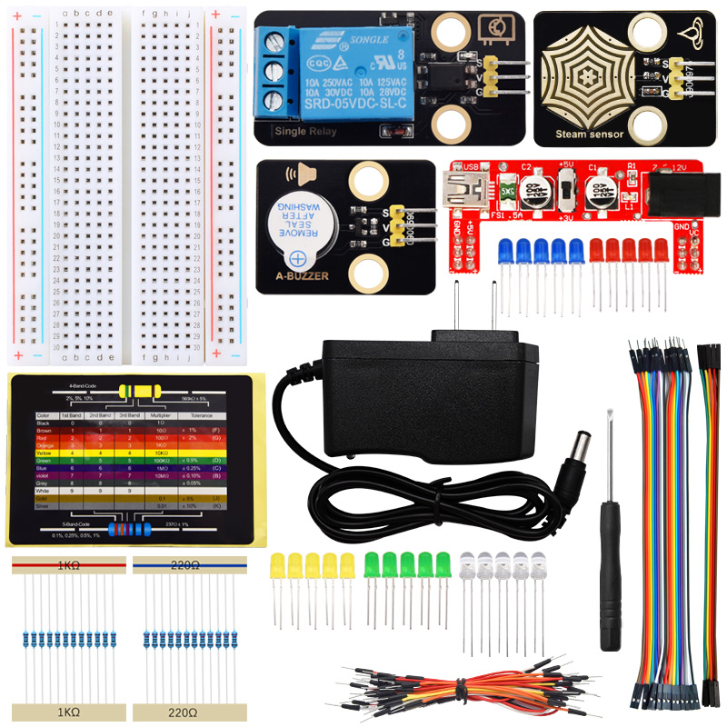
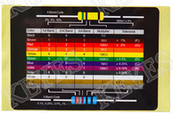

**特别注意：本套件(产品)不包含课程中使用到的开发板，扩展板和USB线，需要另外购买。**

 
 

**首先感谢选择keyes产品，我们将继续为你提供好的产品和服务!**

---

**关于keyes**  

Keyes是KEYES Corporation旗下最畅销的品牌，我们的产品包括Arduino开发板、扩展板、传感器模块；树莓派、micro：bit扩展板和智能小车；以及为各阶段客户设计的完整入门套件。这些入门套件旨在为任何水平的客户学习Arduino、树莓派、micro：bit相关知识。

我们所有产品，均符合国际质量标准，在世界各地不同市场中，得到了极大的赞赏。 

欢迎从我们的官方网站查看更多内容：[http://www.keyes-robot.com](http://www.keyes-robot.com)

---

**售后服务**

1\. 如果发现某些东西丢失或损坏，或者学习套件时遇到一些困难，keyes会提供免费和快速的支持。如果您有任何疑问，请联系我们我们客服或工作人员。

2\. 欢迎提出建议和反馈，我们会根据您的反馈不断更新套件和教程，以使其更好。谢谢！

---

**产品安全** 

1\. 本产品内含细小的元器件（电阻，LED等），请放在儿童接触不到的地方，防止划伤或误食。8岁及以下儿童使用，请在大人监督下使用。

2\. 本产品包含导电部件(控制板和电子模块），请按照本教程的要求进行操作，不当的操作可能导致过热并且损害零件，请勿触摸并立即断开电路电源。

---

**版权** 

keyes商标和徽标是KEYES DIY ROBOT co.,LTD的版权,任何人和公司在没有授权的情况下，不得复制，售卖，转卖，keyes品牌的产品。如果您有兴趣在当地售卖我们的产品，请联系我们专业的批发销售人员。

---

# Keyes 水滴检测套件

---

## 产品介绍

水滴检测套件集于水滴传感器、继电器模块、有源蜂鸣器模块、电阻和各种LED等模块与元件，通过Plus主板或Micro:Bit主板或树莓派Pico主板或ESP32主板或不配主板不编程进行控制。使用Arduino C 软件或MakeCode软件或Mixly软件或KidsBlock软件或Thonny软件进行编程，可以控制LED、蜂鸣器和其他模块工作，并且还可以通过水滴传感器读取水量大小输出的模拟信号，来确定是否下雨及雨量大小。如果检测到的雨量超过一定值时，则蜂鸣器发出警报声，LED会闪烁，从而提醒人们天空正在下强将雨需要采取一些相应的措施。通过这种方式，可以实现极大程度地降低强降雨所带来的损失，水滴检测报警系统适用于家庭或河川水坝等场所。

---

## 清单

当收到这个Keyes水滴检测套件的时候，首先看到是一个包装精美的外盒，每个配件被安全且有序的装在外盒里面的小袋子里，先来清点一下：

| 序号 | 名称 | 数量 | 图片 |
| :--: | :--: | :--: | :--: |
| 1 | 面包板 | 1 | |
| 2 | 水滴传感器 | 1 |  |
| 3 | 5V 单路继电器模块 | 1 |  |
| 4 | 有源蜂鸣器模块 | 1 |  |
| 5  |面包板专用电源模块|1||
| 6 | 220Ω电阻 | 10 |  |
| 7 | 1KΩ电阻 | 10 | |
| 8 | 红色LED | 5 ||
| 9 | 黄色LED | 5 | |
| 10 | 蓝色LED | 5 | |
| 11 | 绿色LED | 5 | |
| 12 | 白色LED | 5 | |
| 13 | 一字型螺丝刀  | 1 ||
| 14 |公对母杜邦线|1| |
| 15 |母对母杜邦线|1| |
| 16 | 面包板连接线 | 1 | |
| 17 |电阻卡 | 1 | |
| 18 | 电源适配器 | 1 | |

---

## 课程

* [1.UNO主板_C_教程](1.UNO主板_C_教程/UNO主板_C_教程.md)

* [2.UNO主板_KidsBlock_教程](2.UNO主板_KidsBlock_教程/UNO主板_KidsBlock_教程.md)

* [3.UNO主板_Mixly_教程](3.UNO主板_Mixly_教程/UNO主板_Mixly_教程.md)

* [4.Microbit主板_教程](4.Microbit主板_教程/Microbit主板_教程.md)

* [5.Pico主板_C_教程](5.Pico主板_C_教程/Pico主板_C_教程.md)

* [6.Pico主板_Python_教程](6.Pico主板_Python_教程/Pico主板_Python_教程.md)

* [7.Esp32主板_C_教程](7.Esp32主板_C_教程/Esp32主板_C_教程.md)

* [8.Esp32主板_Python_教程](8.Esp32主板_Python_教程/Esp32主板_Python_教程.md)

* [9.不配主板_不需编程_教程](9.不配主板_不需编程_教程/不配主板_不需编程_教程.md)

* [代码集](代码集.zip)

* [其他相关资料](其他相关资料.zip)

**特别注意：所有教程的代码都在代码集压缩包里，学习课程之前一定要先下载解压。**

---